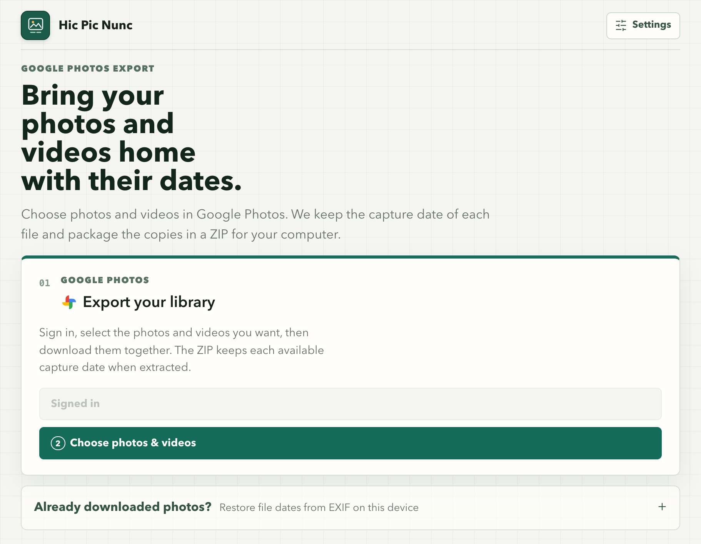

# Hic Pic Nunc

**Where and when, kept in every pic.** Keep the dates and camera details of your photos and videos.

*The name plays on the Latin* hic et nunc, *"here and now": the where and when of every shot, with the pic in between.*

Hic Pic Nunc exports selected photos and videos from Google Photos while keeping their available capture metadata. Download one ZIP to preserve each file's date when you extract it.



## What You Get

- Export selected photos and videos from Google Photos on your computer; there is no hosted service.
- Keep capture date in the image whenever it exists in the source. Photos without one (screenshots, images from messaging apps) are dated with the time Google Photos records for them.
- Videos are exported as Google provides them and dated with their Google Photos time. Google only offers a high-quality transcoded copy of each video, not the original file.
- Choose whether to retain camera details and GPS location in **Settings**. Google removes location from every photo it downloads, so GPS can only be kept for photos restored from your computer.
- Optionally include a readable JSON sidecar; it is off by default.
- Repair file dates on photos already on your device, as long as their EXIF capture date is present.

## Use The App

1. Sign in to Google Photos and choose the photos and videos to export.
2. Open **Settings** in the top-right to choose whether camera details and GPS are included. Capture date is always kept when available. JSON sidecars are optional and off by default.
3. Choose **Export**, then **Download ZIP** on the results page and extract it.

The ZIP is intentional: browsers assign today's date to individual downloads. Extracting the ZIP preserves the photo's capture date as its **file modification date**. Hic Pic Nunc cannot recover a capture date that is missing from the source image.

### Already Downloaded Photos?

Expand **Restore dates on downloaded photos** on the home screen and select the files or folder. The app creates new copies with the file date restored from EXIF; originals remain untouched. If the capture date is absent from EXIF, it cannot be restored.

## Download A Release

Download the right file from the [latest GitHub Release](https://github.com/NicoPietrusco/HicPicNunc/releases/latest):

| Your computer | Download |
| --- | --- |
| Mac with Apple Silicon (M1 and later) | `macOS-arm64.dmg` |
| Mac with Intel processor | `macOS-x64.dmg` |
| Windows | `Windows-x64.zip` |

### macOS Notice

The macOS app is currently unsigned, so Gatekeeper may block it after download.

1. Move `Hic Pic Nunc.app` into `Applications`.
2. Control-click the app in Finder and choose **Open**.
3. Confirm **Open** in the next dialog.

If macOS still blocks an app you intentionally downloaded from this repository, run:

```bash
xattr -dr com.apple.quarantine "/Applications/Hic Pic Nunc.app"
```

### Windows Notice

1. Right-click `HicPicNunc-Windows-x64.zip` and choose **Extract All…**. Don't open the app from inside the ZIP: Windows would copy only the `.exe`, without the files it needs next to it.
2. Open the extracted folder and run `Hic Pic Nunc.exe`.
3. The app is currently unsigned, so SmartScreen may show "Windows protected your PC". Choose **More info**, then **Run anyway**.

If the app doesn't start, its log is in `%LOCALAPPDATA%\GPhotoMetaSync\logs\hicpicnunc.log` (on macOS: `~/Library/Application Support/GPhotoMetaSync/logs/`).

## Google Photos And Privacy

See the [privacy policy](https://nicopietrusco.github.io/HicPicNunc/privacy.html) and the [project site](https://nicopietrusco.github.io/HicPicNunc/).

The app runs only on your computer at `localhost`. Your Google login, selected photos, and metadata preferences are stored or processed locally; there is no hosted Hic Pic Nunc server.

Exported copies are kept only so you can download them: the app deletes them after 24 hours (set `JOB_RETENTION_HOURS` to change this). Working copies of the originals are removed as soon as each photo is processed.

For a published desktop release, end users only sign in with their Google account. They do not need a Google Cloud project or their own OAuth credentials.

## Supported Formats

JPEG, PNG, TIFF, BMP, WebP, HEIC, and HEIF are accepted. HEIC/HEIF support requires the optional `pillow-heif` dependency when running from source.

## Run From Source

Requirements: Python 3.11+, [uv](https://docs.astral.sh/uv/), and optionally [just](https://github.com/casey/just).

```bash
git clone https://github.com/NicoPietrusco/HicPicNunc.git
cd HicPicNunc
just setup
just web
```

For Google Photos when running from source, follow the maintainer setup in [docs/google-oauth-setup.md](docs/google-oauth-setup.md).

## Contributing

See [CONTRIBUTING.md](CONTRIBUTING.md) for development setup, project conventions, testing, and contribution guidelines.

## Development

```bash
just lint
just typecheck
just test
just format
just package
```

| Path | Contents |
| --- | --- |
| `src/hicpicnunc/core/` | EXIF processing, metadata field selection (`metadata_fields.yaml`), export jobs |
| `src/hicpicnunc/google_photos/` | Google OAuth and Picker API client |
| `src/hicpicnunc/web/` | Flask app factory, blueprints in `routes/`, templates and static files |
| `tests/` | Mirrors `src/hicpicnunc/`: one `*_test.py` per module |
| `packaging/` | PyInstaller spec for the desktop releases |

### Releases

Releases are automated with [release-please](https://github.com/googleapis/release-please), based on the Conventional Commit titles of the PRs merged into `main`:

1. After each merge, release-please opens or updates a release PR titled `chore(main): release X.Y.Z`. It bumps `version` in `pyproject.toml` and `uv.lock` and adds the new `feat:` and `fix:` changes to `CHANGELOG.md`. A `feat:` bumps the minor version and a `fix:` the patch version.
2. Merging the release PR creates the `vX.Y.Z` tag and the GitHub release.
3. The same run builds the Apple Silicon macOS, Intel macOS, and Windows apps, smoke-tests them, and attaches them to the release.

To build the apps without publishing them, or to attach them again to an existing release, run the **Release desktop apps** workflow by hand.

release-please runs as a GitHub App, so the CI checks start on its release PR. The App's client ID is stored in the `RELEASE_APP_CLIENT_ID` repository variable and its private key in the `RELEASE_APP_PRIVATE_KEY` secret.

## Support The Project

If Hic Pic Nunc saved your photo dates, a ⭐ on GitHub helps others find it. Bug reports and pull requests are welcome too: see [CONTRIBUTING.md](CONTRIBUTING.md).

## License

[MIT](LICENSE)
