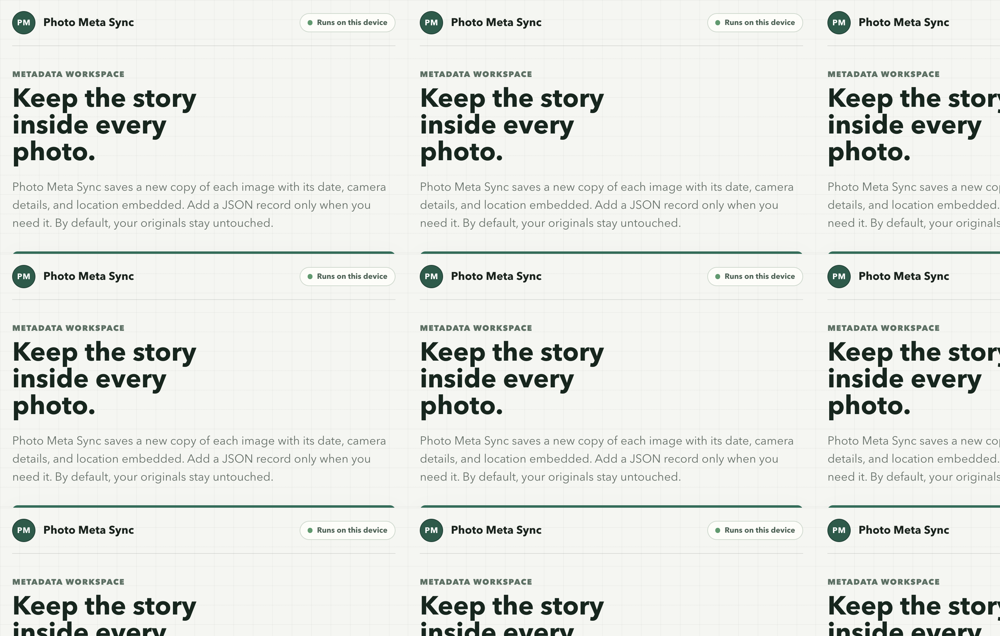

# Photo Meta Sync

Keep the date, camera details, and location inside your photos.

Photo Meta Sync exports selected photos from Google Photos while keeping their available capture metadata. Download one ZIP to preserve each photo's file date when you extract it.



## What You Get

- Export selected photos from Google Photos on your computer; there is no hosted service.
- Keep capture date in the image whenever it exists in the source.
- Choose whether to retain camera details and GPS location in **Settings**.
- Optionally include a readable JSON sidecar; it is off by default.
- Repair file dates on photos already on your device, as long as their EXIF capture date is present.

## Use The App

1. Sign in to Google Photos and choose the photos to export.
2. Open **Settings** in the top-right to choose whether camera details and GPS are included. Capture date is always kept when available. JSON sidecars are optional and off by default.
3. Choose **Save metadata**, then **Download ZIP** on the results page and extract it.

The ZIP is intentional: browsers assign today's date to individual downloads. Extracting the ZIP preserves the photo's capture date as its **file modification date**. Photo Meta Sync cannot recover a capture date that is missing from the source image.

### Already Downloaded Photos?

Expand **Restore dates on downloaded photos** on the home screen and select the files or folder. The app creates new copies with the file date restored from EXIF; originals remain untouched. If the capture date is absent from EXIF, it cannot be restored.

## Download A Release

Download the right file from the [latest GitHub Release](https://github.com/NicoPietrusco/GPhotosMetaSync/releases/latest):

| Your computer | Download |
| --- | --- |
| Mac with Apple Silicon (M1 and later) | `macOS-arm64.dmg` |
| Mac with Intel processor | `macOS-x64.dmg` |
| Windows | `Windows-x64.zip` |

### macOS Notice

The macOS app is currently unsigned, so Gatekeeper may block it after download.

1. Move `Photo Meta Sync.app` into `Applications`.
2. Control-click the app in Finder and choose **Open**.
3. Confirm **Open** in the next dialog.

If macOS still blocks an app you intentionally downloaded from this repository, run:

```bash
xattr -dr com.apple.quarantine "/Applications/Photo Meta Sync.app"
```

## Google Photos And Privacy

The app runs only on your computer at `localhost`. Your Google login, selected photos, and metadata preferences are stored or processed locally; there is no hosted Photo Meta Sync server.

For a published desktop release, end users only sign in with their Google account. They do not need a Google Cloud project or their own OAuth credentials.

## Supported Formats

JPEG, PNG, TIFF, BMP, WebP, HEIC, and HEIF are accepted. HEIC/HEIF support requires the optional `pillow-heif` dependency when running from source.

## Run From Source

Requirements: Python 3.11+, [uv](https://docs.astral.sh/uv/), and optionally [just](https://github.com/casey/just).

```bash
git clone https://github.com/NicoPietrusco/GPhotosMetaSync.git
cd GPhotosMetaSync
just setup
just web
```

For Google Photos when running from source, follow the maintainer setup in [docs/google-oauth-setup.md](docs/google-oauth-setup.md).

## Development

```bash
just lint
just typecheck
just test
just format
just package
```

| Path | Contents |
| --- | --- |
| `src/gphotometasync/core/` | EXIF processing, metadata field selection (`metadata_fields.yaml`), export jobs |
| `src/gphotometasync/google_photos/` | Google OAuth and Picker API client |
| `src/gphotometasync/web/` | Flask app factory, blueprints in `routes/`, templates and static files |
| `tests/` | Mirrors `src/gphotometasync/`: one `*_test.py` per module |
| `packaging/` | PyInstaller spec for the desktop releases |

The release workflow builds Apple Silicon macOS, Intel macOS, and Windows artifacts when a `v*` tag is pushed.

## License

[MIT](LICENSE)
